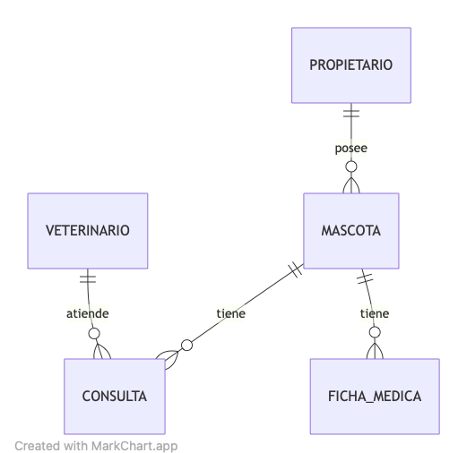

# Django Pet - Bootcamp Codigo Facilito G3

Django Pet es un Sistema de Gestión de Mascotas, Una aplicación para gestionar información de mascotas, citas con veterinarios, y recordatorios para controles.

## Aplicaciones

1. **users** → Para propietarios y veterinarios (gestión de usuarios y autenticación)
2. **pets** → Para la gestión de mascotas y fichas médicas
3. **appointments** → Para la gestión de citas veterinarias
4. **core** → Para historiales médicos y funcionalidades comunes

## Diagrama ER



## Reglas de negocio
* Solo los usuarios autenticados de tipo superuser o staff pueden acceder a los Menús de `Mascotas` y `Consultas` desde el front-end.
* Un veterinario solo puede tener 1 consulta agendada para una fecha y hora específica.
* Si una consulta existente, se marca como `requiere_control=True`, entonces automáticamente el sistema creará una cita para dentro de 25 días después, a la misma hora (Para la misma mascota/veterinario). Esta nueva consulta no require control.
* Si la Mascota cambia su estado a "En tratamiento" entonces automáticamente se creará una Ficha Médica con los datos básicos.
* Si la Mascota cambia su estado a "Fallecido" entonces automáticamente se cancelarán todas las citas de consulta que tenia agendadas dicha mascota.

## Comandos

Run server
```bash
python manage.py runserver
```

shell-plus
```bash
python manage.py shell_plus --ipython
```

migrate:
```bash
python manage.py migrate
```

make migrations:
```bash
python manage.py makemigrations
```

migrate-app:
```bash
python manage.py migrate APP_NAME
```

make migrations-app:
```bash
python manage.py makemigrations APP_NAME
```

Install requirements:
```bash
pip install -r requirements.txt
```

statics:
```bash
python manage.py collectstatic --no-input
```

create superuser:
```bash
python manage.py createsuperuser
```

startapp:
```bash
python manage.py startapp APP_NAME
```

black:
```bash
black .

black --check .
```

## Testing
test:
python manage.py test -v

test-one:
python manage.py test -v TEST_NAME
